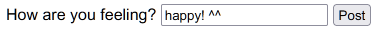
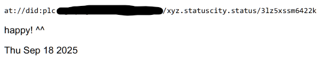
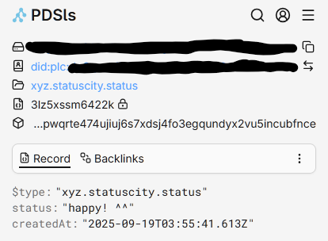

# How to read and write records with `@fujocoded/authproto`

This will involve:

- Creating an ATproto agent, which will interact with ATproto on your behalf. After following the [before you start](#before-you-start) section, you can check out (or copy) [`src/lib/atproto.ts`](./src/lib/atproto.ts) to see how to create the agent.
- Use the ATproto agent to [list records from a collection](./src/components/Status.astro).
- Pairing the ATproto agent with Astro actions to [create new records in a collections](./src/actions/index.ts).

> [!NOTE]
> To create, update, and delete records in your PDS, you'll need to set your OAuth scopes accordingly. `genericData` should be set to true under the `scopes` configuration option.

## Before you start

Other than `@fujocoded/authproto`, you'll also need `@atproto/api` and `@atproto/common-web` to use the code in this example. You can install it with:

```bash
npm install @atproto/api @atproto/common-web
```

## Getting started

For this example, we'll do a status update. You can write text and then display them on your PDS. See [`src/actions/index.ts`](./src/actions/index.ts) for the code.



There's a form in [`src/components/PostStatus.astro`](./src/components/PostStatus.astro) that includes the example Astro Action.



You can use [PDSls](https://pdsls.dev/) to test it out! Search by the handle you used to log in.

